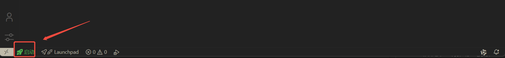
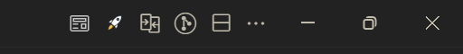

# 🚀 RunX - One-Click Starter for Frontend Projects

> Say goodbye to repetitive CLI commands. Make frontend development silky smooth.


## ✨ Why RunX?

Still juggling different commands to start projects?
- `npm run dev`
- `yarn start`
- `pnpm serve`
- `nx serve myapp`

**RunX** saves your day. With one click, it detects your project type and picks the best start command automatically.

## 🎯 Core Features

### 🧠 Smart Detection
RunX automatically inspects your project structure:
- **Single project**: Starts the most common dev server directly
- **Monorepo**: Lists all packages for you to choose
- **Multiple package managers**: Supports npm, yarn, pnpm, etc.

### ⚡ One-Click Start
Click the rocket icon in the status bar to launch. You can also click any file in the project and use the rocket shown in the top-right to start directly.
1. Detects project type
2. Selects the proper script intelligently
3. Runs in the integrated terminal
4. Streams live status

### 🎨 Polished UI

#### Status Bar Integration


#### Editor Integration


Shows a prominent start button in VSCode’s status bar with left/right positioning options.

When multiple start options are available, a refined picker appears showing:
- 📂 Project name
- ⚡ Script command
- 📝 Script description
- 📍 Project path

### 🔧 Flexible Configuration

```json
{
  "RunX.autoStart": true,
  "RunX.iconLocation": "left",
  "RunX.command": "dev"
}
```

- **Auto start**: Runs directly for single-project setups, no selection needed
- **Icon position**: Show on the left or right side of the status bar
- **Default command**: Specify a unified start command

## 🏗️ Supported Project Types

### 📦 Single Project
For traditional frontend projects:
```
my-project/
├── package.json
├── src/
└── ...
```

### 🏢 Monorepo
Fully supports modern monorepo setups:

#### PNPM Workspace
```yaml
# pnpm-workspace.yaml
packages:
  - 'packages/*'
  - 'apps/*'
```

#### NPM/Yarn Workspaces
```json
{
  "workspaces": [
    "packages/*",
    "apps/*"
  ]
}
```

#### Lerna
```json
{
  "packages": [
    "packages/*"
  ]
}
```

## 🚀 Getting Started

### Install
1. Search for "RunX" in the VSCode Marketplace
2. Click Install
3. Restart VSCode

### First Run
1. Open any frontend project
2. Look for the 🚀 button in the status bar
3. Click it and enjoy one-click start


## ⚠️ Important Notes

### Dependency
RunX relies on `@antfu/ni`, a great universal tool for package managers, to run your project scripts.

#### Auto Install
- 🔄 On first use, if `@antfu/ni` is missing, RunX will install it automatically
- ⏳ Progress notifications will be shown during installation
- ✅ You will get a success message once finished

#### Manual Install (Recommended)
If auto installation fails, install it globally yourself:

```bash
# npm
npm install -g @antfu/ni

# yarn
yarn global add @antfu/ni

# pnpm
pnpm add -g @antfu/ni
```

#### Troubleshooting

**🚫 Failed to start?**
- Check whether `@antfu/ni` is installed
- Ensure network connectivity
- Try installing dependencies manually

**⚡ Permission issues?**
- Windows: Run the terminal as Administrator
- macOS/Linux: Use `sudo` or configure npm’s global directory

**🔍 Verify Installation**
Run the following to verify installation:
```bash
ni --version
```
If a version number is printed, it is installed successfully.

## ⚙️ Advanced Settings

### Custom Start Command
If your project uses conventional script names (dev, server, ...) or shares a prefix (dev:file, dev:fed, ...):

```json
{
  "RunX.command": "start:dev"
}
```

### Icon Position
Place the start button where you prefer:

```json
{
  "RunX.iconLocation": "right"
}
```

### Disable Auto Start
If you prefer manual selection:

```json
{
  "RunX.autoStart": false
}
```

## 🔮 Roadmap

- [ ] Support more frameworks and build tools
- [ ] Add project template scaffolding
- [ ] Provide quick launch for standalone projects
- [ ] Support custom start script templates
- [ ] Add performance monitoring

## 🤝 Contributing

We welcome all kinds of contributions.

- 🐛 File bugs via GitHub Issues
- 💡 Propose features and ideas
- 🔧 Submit Pull Requests
- 📖 Improve documentation

## 📄 License

MIT License - see [LICENSE.md](LICENSE.md)

## 💖 Acknowledgements

Thanks to the following open-source projects:
- [reactive-vscode](https://github.com/antfu/reactive-vscode) - Reactive framework for VSCode extensions
- [@antfu/ni](https://github.com/antfu/ni) - Unified tool for package managers

---

<div align="center">

**Make frontend development easier. Start projects faster.**

[⭐ Star on GitHub](https://github.com/Voyoro/RunX.git) | [🐛 Report Issues](https://github.com/Voyoro/RunX.git/issues) | [💬 Discussions](https://github.com/Voyoro/RunX.git/discussions)

Made with ❤️ by [Voyoro](https://github.com/Voyoro)

</div>
